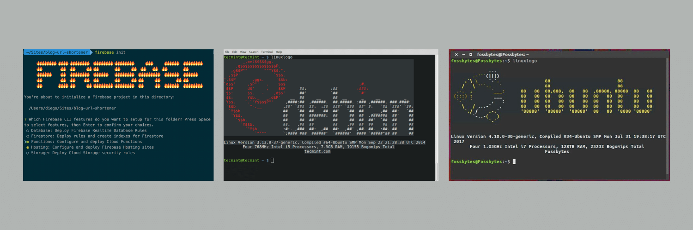

You might have seen ASCII arts on your terminal like the ones below when installing a new module/library in your system. Some developers (or even you might have) configure a static ASCII art which appear when they open their terminal. But have you ever seen a GIF running in your Swiss Army knife like terminal? 👀 That would give life and a personality to your terminal!



Nothing is impossible. Now even playing a GIF on your terminal is possible. GIF has been around us for long 31 years ([seriously](https://en.wikipedia.org/wiki/GIF)? 😲) and what better time it is to see GIF in your terminal.

## Getting Started

Requires Python 3 (with setuptools and pip), zlib, libjpeg, and ffmpeg, other dependencies are installed by `setup.py`.

### Install dependencies

```shell
# Debian based distros
sudo apt-get install ffmpeg zlib* libjpeg* python3-setuptools

# Mac
brew install ffmpeg zlib libjpeg python
```

Your Python environment may need these installation tools -

```shell
sudo easy_install3 pip

# This should enable a pre-built Pillow wheel to be installed, otherwise
# you may need to install Python, zlib, and libjpeg development libraries
# so Pillow can compile from source.

pip3 install --user wheel
```

### Install gif-for-cli

```shell
pip3 install --user gif-for-cli
```

Or download this [repo](https://github.com/google/gif-for-cli) and run:

```bash
python3 setup.py install --user
```

The `gif-for-cli` command will likely be installed into `~/.local/bin` or similar, you may need to put that directory in your \$PATH by adding this to your `.profile`:

```shell

# Linux
if [ -d "$HOME/.local/bin" ] ; then
    PATH="$HOME/.local/bin:$PATH"
fi

# Mac, adjust for Python version
if [ -d "$HOME/Library/Python/3.6/bin/" ] ; then
    PATH="$HOME/Library/Python/3.6/bin/:$PATH"
fi

```

## GIF in action

I’ll be using my favorite [Slackmoji](https://slackmojis.com/) — [Party Parrot](http://cultofthepartyparrot.com/) for playing in the terminal.


Don’t know about Party Parrot? It’s quite an interesting story. Read it out [here](https://mashable.com/2017/07/13/cult-of-the-party-parrot-slack-reddit-meme/).

After the installation, run the following command in your terminal and enjoy the party 😉. The following command queries the [Tenor’s GIF API](https://tenor.com/gifapi) and returns the top GIF.

```bash
gif-for-cli "party parrot"
```

For exploring more gif-for-cli usage options, check the [gif-for-cli repo](https://github.com/google/gif-for-cli/blob/master/README.md#usage).

## What about Windows users? 😕

Currently, this is not supported on Windows platform. Though, there is an [open issue](https://github.com/google/gif-for-cli/issues/5) on GitHub’s repo for Windows Command Prompt and PowerShell support. You can subscribe to that issue or keep a watch on the [repository](https://github.com/google/gif-for-cli). Or a much better initiative, switch to Linux 😎 as soon as possible or just wait forever.

---

Let’s see what GIF you have put up on your terminal. Comment down below your terminal images with GIF in action 📷.

---
